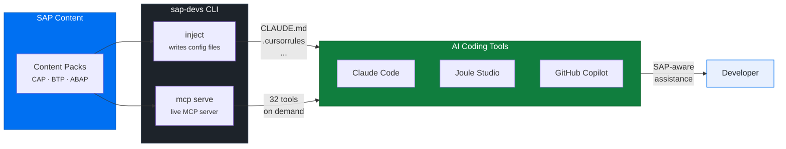

# sap-devs User Guide

`sap-devs` injects up-to-date SAP developer knowledge into your AI coding tools (Claude Code, Cursor, GitHub Copilot, and more), wires SAP MCP servers, and keeps content current automatically.



---

## Installation

### Download

Go to the [GitHub Releases page](https://github.com/SAP-samples/sap-devs-cli/releases) and download the archive for your platform:

| Platform | Architecture | File |
|---|---|---|
| Windows | x64 | `sap-devs_<version>_windows_amd64.zip` |
| macOS | Intel | `sap-devs_<version>_darwin_amd64.tar.gz` |
| macOS | Apple Silicon | `sap-devs_<version>_darwin_arm64.tar.gz` |
| Linux | x64 | `sap-devs_<version>_linux_amd64.tar.gz` |
| Linux | ARM64 | `sap-devs_<version>_linux_arm64.tar.gz` |

### Verify checksum (recommended)

Download `checksums.txt` from the same release and verify:

```bash
# Linux
sha256sum --check checksums.txt

# macOS
shasum -a 256 --check checksums.txt

# Windows (PowerShell)
Get-FileHash sap-devs_<version>_windows_amd64.zip -Algorithm SHA256
# Compare output against checksums.txt
```

### Install

**macOS / Linux:**
```bash
tar -xzf sap-devs_<version>_<os>_<arch>.tar.gz
sudo mv sap-devs /usr/local/bin/
# or without sudo:
mkdir -p ~/.local/bin && mv sap-devs ~/.local/bin/
```

If using `~/.local/bin/`, ensure it is on your `PATH`:
```bash
echo 'export PATH="$HOME/.local/bin:$PATH"' >> ~/.bashrc
source ~/.bashrc
```

**Windows:**
1. Extract the ZIP file.
2. Move `sap-devs.exe` to a folder on your `PATH`, or add its folder to `PATH`:
   - Open **System Properties** → **Environment Variables**
   - Under **User variables**, edit `Path` and add the folder containing `sap-devs.exe`
   - Open a new terminal for the change to take effect

### Verify

```bash
sap-devs version
```

---

## First-Time Setup

Run the setup wizard:

```bash
sap-devs init
```

The wizard will:

1. Download SAP developer content (initial sync)
2. Ask you to select a developer profile (e.g. `cap-developer`, `btp-developer`, `abap-developer`)
3. Inject SAP context into all detected AI tools
4. Optionally add `sap-devs tip` to your shell profile so you see a tip on every new terminal

---

## Core Workflow

### Keep content current

```bash
sap-devs sync
```

Fetches the latest SAP developer content from the official repo. Run this periodically or after major SAP releases.

### Inject context into AI tools

```bash
# Inject into all detected tools at user (global) scope
sap-devs inject

# Inject into the current project only
sap-devs inject --project

# Preview what would be written without making changes
sap-devs inject --dry-run

# Remove all previously injected SAP context from AI tool config files
sap-devs inject --uninstall

# Preview what --uninstall would remove without making changes
sap-devs inject --uninstall --dry-run

# Report injection state across all AI tools
sap-devs inject --status

# Report with file size and token breakdown
sap-devs inject --status --verbose

# Report as JSON (for scripting / CI)
sap-devs inject --status --json
```

### Choose your developer profile

```bash
sap-devs profile list           # see available profiles
sap-devs profile set cap-developer  # set the active profile
sap-devs profile show           # show active profile and pack weights
```

---

## Command Reference

### `inject`

Push SAP context into all detected AI tools.

```
sap-devs inject [flags]
```

| Flag | Description |
|---|---|
| `--project` | Inject at project scope (writes to project config files in the current directory) |
| `--tool <id>` | Inject into a specific tool only (e.g. `claude-code`, `cursor`) |
| `--dry-run` | Preview changes without writing files |
| `--uninstall` | Remove all previously injected SAP context from AI tool config files |
| `--status` | Report injection state (present/stale/not found) for all AI tool config files |
| `--json` | Output status as JSON array (only with `--status`) |
| `--verbose` | Show file size and token breakdown columns (only with `--status`) |
| `--stats` | Show a per-adapter table of packs included, approximate token count, and budget status |
| `--sync` | Force a content sync before injecting (no prompt) |
| `--no-sync` | Skip the freshness check; use cached content as-is |

**Example:**
```bash
sap-devs inject --tool claude-code --dry-run
sap-devs inject --stats --dry-run
sap-devs inject --uninstall
sap-devs inject --uninstall --dry-run
```

**`--uninstall` output example:**

```text
Uninstalled SAP developer context:
  ~/.claude/CLAUDE.md  — section removed
  ~/.cursor/rules/sap-developer-context.mdc  — file deleted
```

**`--status` output example:**

```text
Tool            Scope    File                        Status
Claude Code     global   ~/.claude/CLAUDE.md         ✓ current
Cursor          global   ~/.cursor/rules/sap.mdc     ✗ not found
```

**`--status --verbose` output example:**

```text
Tool            Scope    File                    Status      Size     Tokens  SAP%  Other sections
Claude Code     global   ~/.claude/CLAUDE.md     ✓ current   14200 B  3200    42%   1
```

**`--stats` output example:**

```text
Adapter       Packs included          Tokens (approx)   Budget         Status
claude-code   cap, btp-core, abap     ~750              unconstrained
cursor        cap, btp-core           ~500              2000 tokens    trimmed
```

---

### Authentication

`sap-devs sync` fetches content from `github.com/SAP-samples`, which requires a Personal Access Token if you are inside the SAP corporate network.

**When you need a token:** Only when syncing from `github.com/SAP-samples` on the SAP corporate network. If you are outside SAP, no token is needed.

**Token resolution order** (first match wins):

1. `GITHUB_TOOLS_SAP_TOKEN` environment variable
2. `GH_TOKEN` environment variable
3. `GITHUB_TOKEN` environment variable
4. Token stored with `sap-devs config token`

**Storing a token (interactive — recommended for developer machines):**

```sh
sap-devs config token
# Prompts: Enter GitHub token (input hidden, will not appear in shell history):
```

**Storing a token (non-interactive — scripted or CI):**

```sh
sap-devs config token ghp_yourtoken
# Warning: token passed as argument may be saved in shell history.
```

For CI/CD, set `GITHUB_TOOLS_SAP_TOKEN` as a pipeline secret instead — no local storage needed.

**Where tokens are stored:** The OS keychain (macOS Keychain, Windows Credential Manager, Linux Secret Service). On headless systems without a keychain, a credentials file at `~/.config/sap-devs/credentials` (Linux) with restricted permissions (owner read/write only). Tokens are **never** stored in `config.yaml`.

**Removing a stored token:**

```sh
sap-devs config token --delete
```

**Viewing token status:**

```sh
sap-devs config show
# github_token:    ghp_****
```

---

### `sync`

Pull the latest SAP developer content from the official repo.

```
sap-devs sync [flags]
```

| Flag | Description |
|---|---|
| `--force` | Re-sync all content regardless of TTL |
| `--category <name>` | Sync a single category only (e.g. `tips`, `tools`, `resources`, `context`, `mcp`, `advocates`) |

---

### `profile`

Manage your developer profile.

```
sap-devs profile list
sap-devs profile set <profile-id>
sap-devs profile show
```

| Subcommand | Description |
|---|---|
| `list` | List all available profiles |
| `set <id>` | Set the active profile |
| `show` | Show the active profile and pack weights |

**Example:**
```bash
sap-devs profile set btp-developer
```

---

### `config`

View and edit `sap-devs` configuration.

```
sap-devs config show
sap-devs config set <key> <value>
sap-devs config company <git-url>
```

| Subcommand | Description |
|---|---|
| `show` | Display the current configuration |
| `set <key> <value>` | Set a configuration value |
| `company <url>` | Configure the company content repo URL (HTTPS) |

**Common config keys:**

| Key | Description | Example |
|---|---|---|
| `language` | Language tag for CLI output and content | `de`, `en` |

> The company content repo is configured via `sap-devs config company <url>` rather than `config set`.

---

### `tip`

Print a SAP developer tip from your active profile's packs. The tip rotates daily.

```bash
sap-devs tip
```

#### `tip install`

Add `sap-devs tip` to your shell profile(s).

```bash
sap-devs tip install
```

#### `tip uninstall`

Remove `sap-devs tip` from your shell profile(s).

```bash
sap-devs tip uninstall
```

#### Adding a daily tip to your terminal startup

During `sap-devs init` you can opt in to this automatically. If you skipped it, run:

```bash
sap-devs tip install
```

This adds `sap-devs tip` to every shell profile found on your system (`.zshrc`, `.bashrc`, `.bash_profile`, `.zprofile` on Linux/macOS; PowerShell profile and Git Bash profiles on Windows).

To remove it:

```bash
sap-devs tip uninstall
```

Open a new terminal and you will see a tip on startup.

**Manual setup (if `tip install` doesn't find your profile):**

```bash
# bash — ~/.bashrc or ~/.bash_profile
echo -e '\n# SAP developer tips\nsap-devs tip' >> ~/.bashrc

# zsh — ~/.zshrc
echo -e '\n# SAP developer tips\nsap-devs tip' >> ~/.zshrc
```

PowerShell — add to your `$PROFILE`:

```powershell
Add-Content $PROFILE "`n# SAP developer tips`nsap-devs tip"
```

---

### `completion`

Generate shell completion scripts so you can tab-complete `sap-devs` commands and flags in your terminal. The completion script is printed to stdout — you need to source or install it yourself.

```
sap-devs completion <shell>
```

Supported shells: `bash`, `zsh`, `fish`, `powershell`

#### bash

```bash
# Current session only
source <(sap-devs completion bash)

# Permanent — add to your ~/.bashrc or ~/.bash_profile
echo 'source <(sap-devs completion bash)' >> ~/.bashrc
source ~/.bashrc
```

#### zsh

```zsh
# Current session only
source <(sap-devs completion zsh)

# Permanent — write to a file on your $fpath
sap-devs completion zsh > "${fpath[1]}/_sap-devs"
```

If you see `command not found: compdef`, enable completions first:

```zsh
echo 'autoload -U compinit; compinit' >> ~/.zshrc
```

#### fish

```fish
sap-devs completion fish | source

# Permanent
sap-devs completion fish > ~/.config/fish/completions/sap-devs.fish
```

#### PowerShell

```powershell
# Current session only
sap-devs completion powershell | Out-String | Invoke-Expression

# Permanent — add to your $PROFILE
Add-Content $PROFILE "`nsap-devs completion powershell | Out-String | Invoke-Expression"
```

---

### `doctor`

Check that the tools required by your active profile are installed and meet version requirements.

```
sap-devs doctor [flags]
```

| Flag | Description |
|---|---|
| `--fix` | Print install commands for failed or missing tools |
| `--profile <id>` | Check a specific profile (`@active` for the configured profile) |

> **Note:** Without `--profile`, `doctor` checks tools from **all packs**, not just your active profile. Use `sap-devs doctor --profile @active` to check only the tools required by your configured profile.

**Example:**
```bash
sap-devs doctor --fix
```

Output:
```
TOOL       REQUIRED    FOUND      STATUS
nodejs     >=18.0.0    20.11.0    ok
cds-dk     >=7.0.0     -          MISSING

Install commands:
  cds-dk: npm install -g @sap/cds-dk
```

---

### `mcp`

Manage SAP MCP (Model Context Protocol) servers. MCP servers give AI tools direct access to SAP APIs and documentation.

```
sap-devs mcp list [--all]
sap-devs mcp status
sap-devs mcp install [id] [--all] [--dry-run]
sap-devs mcp serve [--profile <id>]
```

| Subcommand | Description |
|---|---|
| `list` | List available SAP MCP servers (active profile by default; `--all` for all) |
| `status` | Show which SAP MCP servers are registered in your AI tool configs |
| `install [id]` | Wire an SAP MCP server into your AI tools; `--all` installs all for active profile |
| `serve` | Start the built-in MCP server on stdio (for AI tool integration) |

**`serve` flags:**

| Flag | Description |
|---|---|
| `--profile <id>` | Override the active profile for this server session |

#### Built-in MCP Server

`sap-devs mcp serve` starts a built-in MCP server that exposes SAP developer knowledge as live tools for AI agents. The server communicates over stdio using the JSON-RPC-based MCP protocol.

**Available tools:**

| Tool | Description |
|---|---|
| `list_packs` | List all available content packs with metadata |
| `get_context` | Get the AI context text for a specific pack or all packs |
| `get_tip` | Get a random SAP developer tip, optionally filtered by tags |
| `search_resources` | Search curated SAP resources by keyword |
| `get_known_errors` | Get known SAP error patterns, optionally filtered by keyword or pack |
| `get_samples` | Get canonical SAP code samples, optionally filtered by pack or keyword |
| `get_recent_news` | Get the latest SAP Developer News episodes |
| `search_tutorials` | Search SAP tutorials by keyword |
| `search_learning_journeys` | Search SAP Learning Journeys by keyword |

**Self-install:** The built-in server is registered in `mcp.yaml` as `sap-devs-server`. To wire it into your AI tools:

```bash
sap-devs mcp install sap-devs-server
```

This configures supported AI tools (Claude Code, Cursor, Continue) to launch `sap-devs mcp serve` as an MCP server.

**Example:**
```bash
sap-devs mcp list
sap-devs mcp install cap-mcp-server
```

---

### `resources`

Browse curated SAP developer resources from your active profile's packs.

```
sap-devs resources list
sap-devs resources search <query>
sap-devs resources open <id>
```

| Subcommand | Description |
|---|---|
| `list` | List all resources for the active profile |
| `search <query>` | Search resources by keyword (searches across all packs, not just the active profile) |
| `open <id>` | Open a resource URL in the default browser |

> **Note:** `resources list` requires an active profile. Run `sap-devs profile set <id>` first if you haven't done so.

---

### `update`

Update `sap-devs` to the latest release.

```bash
sap-devs update
```

Checks GitHub for a newer release and installs it if found.

---

### `init`

First-time setup wizard. Run once after installation.

```bash
sap-devs init
```

---

### `discovery`

Browse the SAP Discovery Center — guided learning missions, BTP service catalog, and the BTP Guidance Framework.

```
sap-devs discovery [flags]
sap-devs discovery missions list [flags]
sap-devs discovery missions search <query> [flags]
sap-devs discovery missions open <id>
sap-devs discovery services list [flags]
sap-devs discovery services search <query>
sap-devs discovery services open <id>
sap-devs discovery guidance [flags]
sap-devs discovery guidance show <id>
sap-devs discovery guidance open <id>
```

**Persistent flags (all subcommands):**

| Flag | Description |
|---|---|
| `--all` | Bypass profile filtering; show all missions/services |
| `--force` | Bypass cache and re-fetch from the API |
| `--count`, `-n` | Limit results (default: 20) |

**`missions` flags:**

| Flag | Description |
|---|---|
| `--category <code>` | Filter by category code |
| `--product <name>` | Filter by product |
| `--effort <0-3>` | Filter by effort level |

**`services` flags:**

| Flag | Description |
|---|---|
| `--category <name>` | Filter by service category |
| `--deprecated` | Include deprecated services |

**`guidance` flags:**

| Flag | Description |
|---|---|
| `--domain <name>` | Filter by domain (e.g., `Extensibility`, `Integration`) |

| Subcommand | Description |
|---|---|
| `missions list` | List Discovery Center missions for the active profile |
| `missions search <query>` | Search missions via the Discovery Center API |
| `missions open <id>` | Open a mission in the browser |
| `services list` | List BTP services for the active profile |
| `services search <query>` | Search the BTP service catalog |
| `services open <id>` | Open a service in the Discovery Center |
| `guidance` | List BTP Guidance Framework phases and topics |
| `guidance show <id>` | Show guidance content for a topic |
| `guidance open <id>` | Open a guidance topic in the browser |

**Example:**

```bash
sap-devs discovery missions list
sap-devs discovery missions search "HANA"
sap-devs discovery services list --category "Integration"
sap-devs discovery guidance --domain Extensibility
```

---

### `events`

Browse upcoming SAP community events (CodeJams, TechEd, Devtoberfest, etc.).

```
sap-devs events [flags]
sap-devs events open <id>
sap-devs events types
sap-devs events export [flags]
```

| Flag | Description |
|---|---|
| `--all`, `-a` | Show all events regardless of configured location |
| `--type`, `-t` | Filter by event type ID |
| `--count`, `-n` | Max events to display (default: 10) |

| Subcommand | Description |
|---|---|
| `open <id>` | Open an event URL in the browser |
| `types` | List available event type IDs |
| `export` | Export events to a calendar file (ICS/VCS) or generate Google/Outlook URLs |

**Example:**

```bash
sap-devs events
sap-devs events --type codejam
sap-devs events types
sap-devs events export --format google
```

---

### `hook`

Manage AI tool lifecycle hooks from pack definitions. Hooks wire commands into AI tool session-start or other lifecycle events.

```
sap-devs hook list [--all]
sap-devs hook install [id] [--dry-run]
sap-devs hook uninstall <id>
sap-devs hook status
```

| Subcommand | Description |
|---|---|
| `list` | List available hooks (active profile by default; `--all` for all packs) |
| `install [id]` | Wire a hook (or all profile hooks if no id) into your AI tool configs |
| `uninstall <id>` | Remove a hook from your AI tool configs |
| `status` | Show which hooks are installed in your AI tool configs |

**Example:**

```bash
sap-devs hook list
sap-devs hook install sap-news-friday
sap-devs hook status
```

---

### `influencers`

Browse SAP community influencers and thought leaders.

```
sap-devs influencers [flags]
sap-devs influencers open <id> [--link <type>]
```

| Flag | Description |
|---|---|
| `--all`, `-a` | Show all influencers regardless of profile |
| `--pack`, `-p` | Filter to a specific pack |
| `--tags`, `-t` | Filter by comma-separated focus tags (OR match) |
| `--random`, `-r` | Show one random influencer |

**Example:**

```bash
sap-devs influencers
sap-devs influencers --tags CAP,BTP
sap-devs influencers open dj-adams --link blog
```

---

### `learning`

Browse SAP Learning Journeys from learning.sap.com.

```
sap-devs learning [flags]
sap-devs learning list [flags]
sap-devs learning search <query> [flags]
sap-devs learning show <slug>
sap-devs learning open <slug>
```

**Persistent flags:**

| Flag | Description |
|---|---|
| `--all` | Bypass profile filtering |
| `--level <level>` | Filter by level (`beginner`, `intermediate`, `advanced`) |
| `--role <role>` | Filter by target role |
| `--count`, `-n` | Limit results (default: 20) |

**`list` flags:**

| Flag | Description |
|---|---|
| `--pack <id>` | Filter to a specific pack's curated journeys |

| Subcommand | Description |
|---|---|
| `list` | List learning journeys for the active profile (default subcommand) |
| `search <query>` | Search journeys via the learning.sap.com API with local fallback |
| `show <slug>` | Display full details for a learning journey |
| `open <slug>` | Open a learning journey in the browser |

**Example:**

```bash
sap-devs learning
sap-devs learning list --level beginner
sap-devs learning search "CAP"
sap-devs learning show cap-learning-journey
```

---

### `news`

Browse SAP Developer News episodes from the SAP Developers YouTube channel.

```
sap-devs news [--count <n>]
sap-devs news list [--count <n>]
sap-devs news latest
sap-devs news open <id>
sap-devs news search <query>
sap-devs news read <id> [--plain]
```

| Flag | Description |
|---|---|
| `--count`, `-n` | Number of episodes to show (default: 10) |

| Subcommand | Description |
|---|---|
| `list` | List recent episodes with YouTube and SAP Community links |
| `latest` | Open the most recent episode in the browser |
| `open <id>` | Open a specific episode by list number in the browser |
| `search <query>` | Search episodes by title or description |
| `read <id>` | Read the SAP Community blog post for an episode in the terminal |

**Example:**

```bash
sap-devs news list
sap-devs news latest
sap-devs news search "HANA"
sap-devs news read 3 --plain
```

---

### `samples`

Browse canonical SAP code samples from the active profile's packs.

```
sap-devs samples list [flags]
sap-devs samples search <query>
sap-devs samples open <id>
sap-devs samples clone <id>
```

**`list` flags:**

| Flag | Description |
|---|---|
| `--all`, `-a` | Show all samples regardless of profile |
| `--pack`, `-p` | Filter to a specific pack |
| `--tags`, `-t` | Filter by comma-separated tags (OR match) |

| Subcommand | Description |
|---|---|
| `list` | List samples for the active profile |
| `search <query>` | Search samples across all packs |
| `open <id>` | Open a sample URL in the browser |
| `clone <id>` | Clone the sample's GitHub repository locally |

**Example:**

```bash
sap-devs samples list
sap-devs samples search "CAP"
sap-devs samples clone cap-bookshop
```

---

### `tutorial`

Browse and render SAP tutorials from the SAP Developers portal.

```
sap-devs tutorial list [flags]
sap-devs tutorial search <query> [flags]
sap-devs tutorial show <slug> [flags]
sap-devs tutorial open <slug>
```

**`list` flags:**

| Flag | Description |
|---|---|
| `--all`, `-a` | Show all tutorials regardless of profile |
| `--pack`, `-p` | Filter to a specific pack |
| `--level`, `-l` | Filter by level (`beginner`, `intermediate`, `advanced`) |
| `--tags`, `-t` | Comma-separated tags to filter (OR match) |

**`search` flags:**

| Flag | Description |
|---|---|
| `--level`, `-l` | Filter results by level |
| `--tags`, `-t` | Filter results by comma-separated tags |

**`show` flags:**

| Flag | Description |
|---|---|
| `--interactive`, `-i` | Interactive step-by-step TUI mode |
| `--step <n>` | Jump to a specific step number |

| Subcommand | Description |
|---|---|
| `list` | List tutorials for the active profile |
| `search <query>` | Search the full tutorial index across all repos |
| `show <slug>` | Render a tutorial with steps in the terminal |
| `open <slug>` | Open a tutorial in the browser |

**Example:**

```bash
sap-devs tutorial list --level beginner
sap-devs tutorial search "CAP"
sap-devs tutorial show cap-service-add-auth -i
```

---

### `videos`

Browse SAP YouTube videos from pack-curated sources.

```text
sap-devs videos [flags]
sap-devs videos list [flags]
sap-devs videos search <query>
sap-devs videos open <id>
```

**`list` flags:**

| Flag | Description |
|---|---|
| `--count`, `-n` | Number of videos to show (default: 20) |
| `--source <id>` | Filter by source ID |
| `--pack <id>` | Filter by pack ID |

| Subcommand | Description |
|---|---|
| `list` | List videos for the active profile, newest first (default subcommand) |
| `search <query>` | Search videos by title across all packs |
| `open <id>` | Open a video by list number or ID in the browser |

**Example:**

```bash
sap-devs videos list
sap-devs videos search "CAP"
sap-devs videos open 3
```

---

### `learn`

Guided learning recommendations combining tutorials, learning journeys, and Discovery Center missions.

```bash
sap-devs learn [flags]
sap-devs learn recommend [flags]
sap-devs learn search <query>
sap-devs learn path list [flags]
sap-devs learn path show <path-id>
sap-devs learn path open <path-id>
```

| Flag | Description |
|---|---|
| `--level` | Filter by experience level (`beginner`, `intermediate`, `advanced`) |
| `--all` | Bypass profile filtering, show content from all packs |
| `--count`, `-n` | Max items per section (recommend) or total (search). Default: 10 |
| `--pack` | Filter to a specific pack (recommend and path list only) |

| Subcommand | Description |
|---|---|
| `recommend` | Show recommended content in sections (Journeys / Tutorials / Missions). Default subcommand |
| `search <query>` | Cross-type search with unified results table |
| `path list` | List available learning paths (curated + auto-generated) |
| `path show <id>` | Display a learning path with numbered steps and URLs |
| `path open <id>` | Open the first step of a learning path in the browser |

**Example:**

```bash
sap-devs learn                           # show recommendations
sap-devs learn --level beginner          # filter to beginner content
sap-devs learn search "CAP deployment"   # cross-type search
sap-devs learn path list --pack cap      # list CAP learning paths
sap-devs learn path show cap-getting-started  # show path details
```

---

## Configuration

The configuration file is at:

| OS | Path |
|---|---|
| Linux | `~/.config/sap-devs/config.yaml` |
| macOS | `~/Library/Application Support/sap-devs/config.yaml` |
| Windows | `%APPDATA%/sap-devs/config.yaml` |

View with `sap-devs config show`. Edit with `sap-devs config set <key> <value>`.

---

## MCP Servers

MCP (Model Context Protocol) servers extend AI tools with direct access to external APIs and data. `sap-devs` can configure SAP MCP servers in your AI tool settings automatically, and includes a built-in server that exposes SAP developer knowledge as live tools.

```bash
sap-devs mcp list          # see what's available
sap-devs mcp status        # see what's already configured
sap-devs mcp install <id>  # wire a server into your AI tools
sap-devs mcp serve         # start the built-in MCP server on stdio
```

The built-in server (`sap-devs-server`) can be installed with `sap-devs mcp install sap-devs-server`. It exposes 9 tools: `list_packs`, `get_context`, `get_tip`, `search_resources`, `get_known_errors`, `get_recent_news`, `search_tutorials`, `search_learning_journeys`, and `get_samples`.

Supported AI tools include Claude Code, Cursor, Continue, and others detected on your system.

---

## Keeping Up to Date

On every command invocation, `sap-devs` checks GitHub for a newer release in the background (at most once per 7 days). If a new version is available, you'll see a notification in the terminal after the command completes.

To update immediately:

```bash
sap-devs update
```

---

## Troubleshooting

**"No tips available" or context appears empty**
→ Run `sap-devs sync` to download the latest content.

**AI tool not detected by `inject`**
→ Ensure the tool is installed and its CLI is on your `PATH`. Check with `sap-devs doctor`.

**`doctor` shows FAIL or MISSING**
→ Run `sap-devs doctor --fix` to see install commands for the missing tools.

**Windows: `sap-devs` not found after installation**
→ Open a new terminal after adding the folder to `PATH`. Environment variable changes require a new shell session.

**Inject writes the wrong language**
→ Set your language: `sap-devs config set language en` (or `de`, etc.).

---

## Platform Notes

Config, cache, and data directories per OS:

| Purpose | Linux | macOS | Windows |
|---|---|---|---|
| Config | `~/.config/sap-devs` | `~/Library/Application Support/sap-devs` | `%APPDATA%/sap-devs` |
| Cache | `~/.cache/sap-devs` | `~/Library/Caches/sap-devs` | `%LOCALAPPDATA%/sap-devs/cache` |
| Data (user content) | `~/.local/share/sap-devs` | `~/Library/Application Support/sap-devs/data` | `%LOCALAPPDATA%/sap-devs/data` |

On Linux, XDG environment variables (`XDG_CONFIG_HOME`, `XDG_CACHE_HOME`, `XDG_DATA_HOME`) are honoured.
